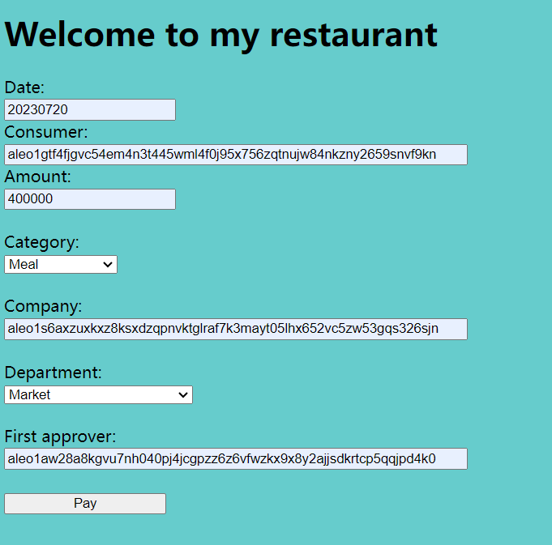
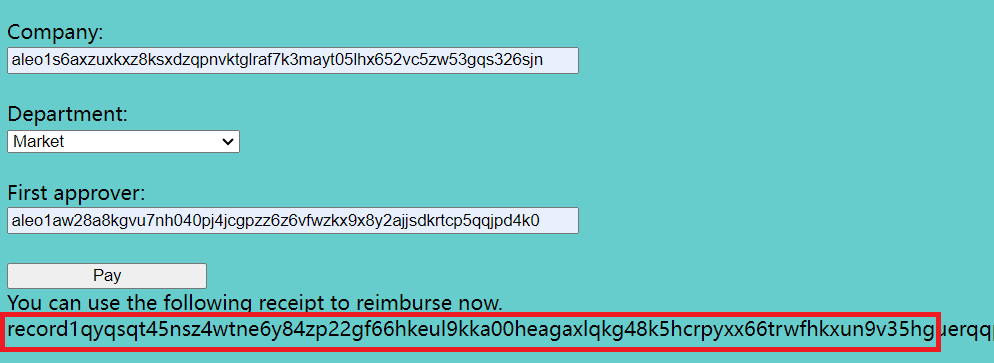
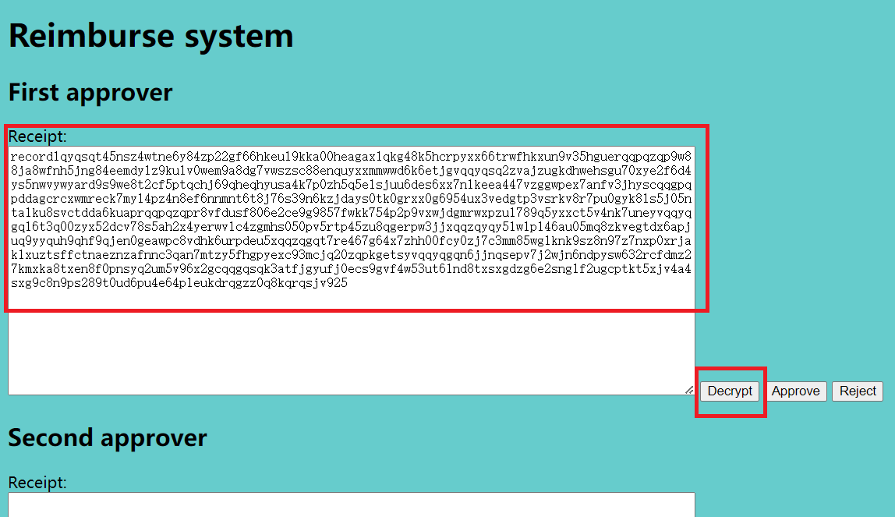
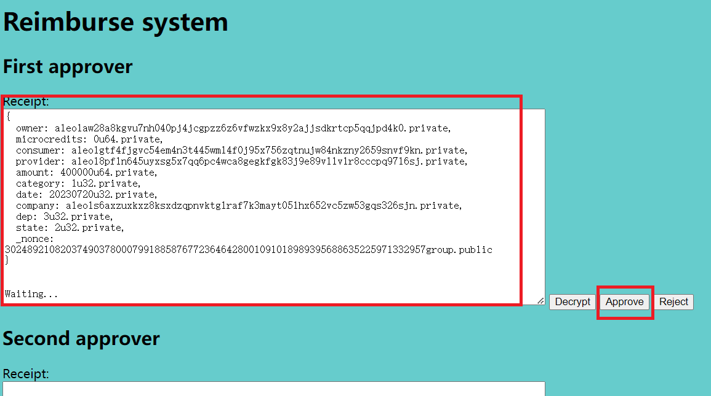
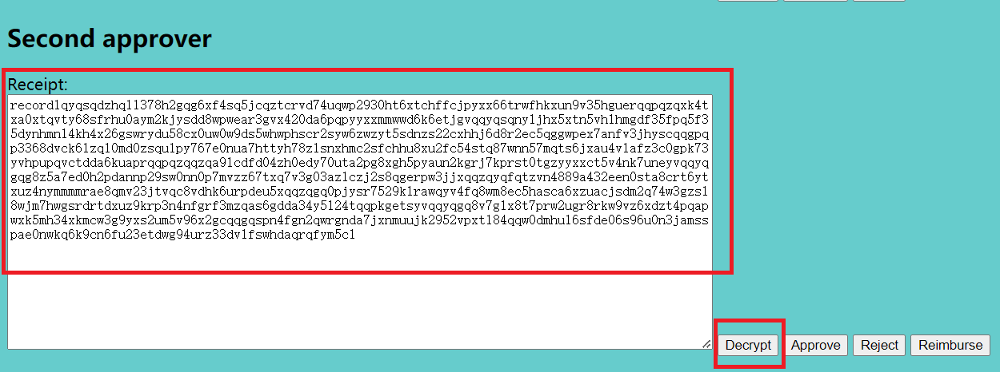
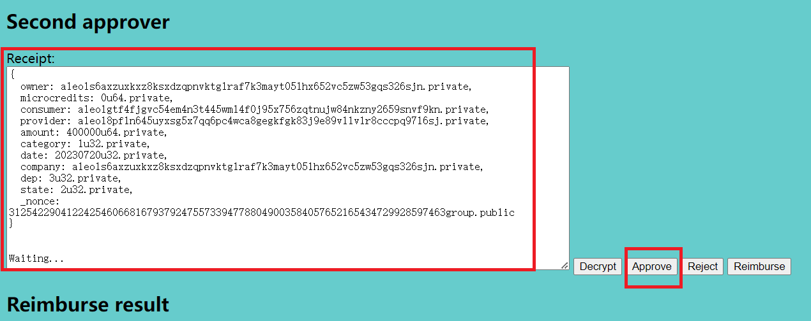
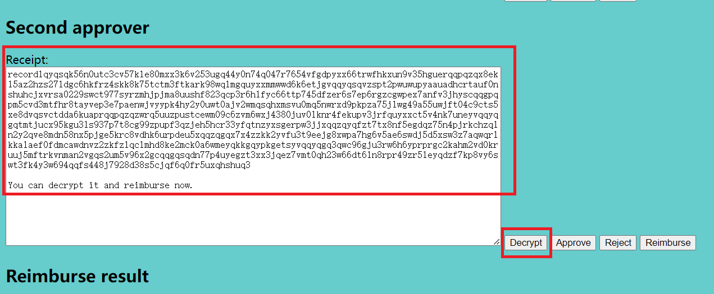
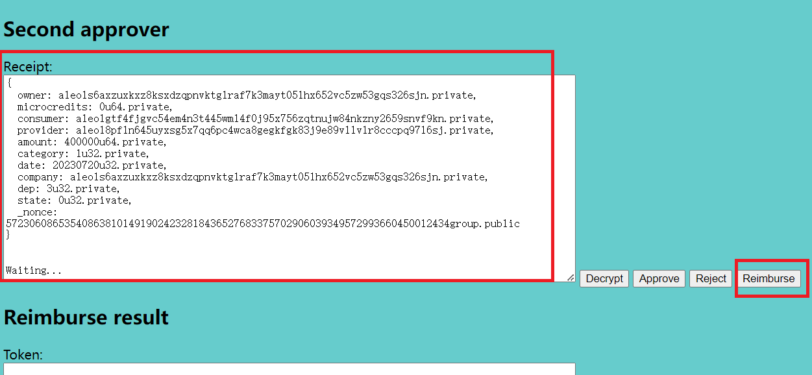
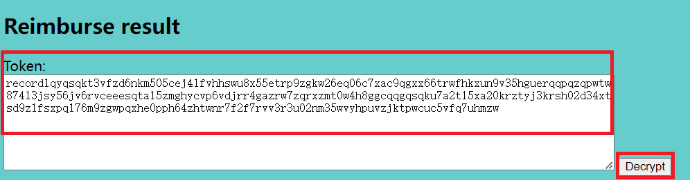

# reimburse

## Introduction
This is a demo for '_token_receipt_' which is an aleo program you can find on <https://github.com/qbitshero/token_receipt>.
It is a solution for reimbursement with privacy coins. In this demo, there is a simple web payment system of a restaurant, and a reimburse system. Suppose that you have a meal in the restaurant, and you pay it, with filling information required, getting a receipt. Then you reimburse it in company.

## How to run this demo backend

### The components of this demo
We need a web page to simulate payment, to fille 'date', 'consumer', 'amount', 'category', 'company', 'department' and 'first approver' information.
We need another web page to simulate reimbursement, which contains 'decrypt', 'approve', 'reject' and 'reimburse' operations.
The main files are restaurant.py, reimburse.py, restaurant.conf, reimburse.conf, shutdown.sh and start.sh.

### Prerequisite
On the environment, snarkos and python2 (including flask framework) must be installed. New aleo account is not neccessary because we have binded account, private key and view key to this demo. You can check these information in restaurant.conf and reimburse.conf.

### Deploy restaurant and reimburse server
Before start servers, you need check account info in restaurant.conf.
```
aleo1gtf4fjgvc54em4n3t445wml4f0j95x756zqtnujw84nkzny2659snvf9kn
APrivateKey1zkp4q9fRBQrtDNjGi1ywCUa3YzqCydrRzxCYCncPwjZc4ZX
AViewKey1pCPns4v7kWEfNaPracGkVWHvufT3NGGJS3S9DYCVrdDr
"{
  owner: aleo1gtf4fjgvc54em4n3t445wml4f0j95x756zqtnujw84nkzny2659snvf9kn.private,
  microcredits: 49735016u64.private,
  _nonce: 413785834010839426456739048294197888554486460695008324805281827745921944062group.public
}"
"{
  owner: aleo1gtf4fjgvc54em4n3t445wml4f0j95x756zqtnujw84nkzny2659snvf9kn.private,
  microcredits: 0u64.private,
  amount: 398130000u64.private,
  _nonce: 7482881147238177569356632069107730087600974785560171076972189082572135429074group.public
}"
```
**The first record is aleo credits and the second record is token to consume. You need transfer enough aleo credits to aleo1gtf4fjgvc54em4n3t445wml4f0j95x756zqtnujw84nkzny2659snvf9kn for fee. Then replace the credits record in restaurant.conf. Don't delete the double quotations near credits record.**


And check account info in reimburse.conf.
```
aleo1aw28a8kgvu7nh040pj4jcgpzz6z6vfwzkx9x8y2ajjsdkrtcp5qqjpd4k0
APrivateKey1zkpGZFMULJESNX4BzucJXrymZxNzPuLEAZ6qsQxqm7sLvHf
AViewKey1kSgFeQUyNVGhcXYpLmESsKLs4JvodrhLPv1uLrxm3TrF
aleo1s6axzuxkxz8ksxdzqpnvktglraf7k3mayt05lhx652vc5zw53gqs326sjn
APrivateKey1zkp5Y4Ytn8mLaim2frzYJb5Ykv3SaTJxGuamByUyYYjf7Vb
AViewKey1odyPNFbkSds4qWpXYJtSGTSfBmDANWX1w8PpDWPkWj4v
aleo1gtf4fjgvc54em4n3t445wml4f0j95x756zqtnujw84nkzny2659snvf9kn
APrivateKey1zkp4q9fRBQrtDNjGi1ywCUa3YzqCydrRzxCYCncPwjZc4ZX
AViewKey1pCPns4v7kWEfNaPracGkVWHvufT3NGGJS3S9DYCVrdDr
"{
  owner: aleo1aw28a8kgvu7nh040pj4jcgpzz6z6vfwzkx9x8y2ajjsdkrtcp5qqjpd4k0.private,
  microcredits: 49675450u64.private,
  _nonce: 7270394324193963188288341461606668744909826997448779029980691945688994238034group.public
}"
"{
  owner: aleo1s6axzuxkxz8ksxdzqpnvktglraf7k3mayt05lhx652vc5zw53gqs326sjn.private,
  microcredits: 37077815u64.private,
  _nonce: 2257256584893796979188333923191854092195137160477457200521999228694562042778group.public
}"
"{
  owner: aleo1s6axzuxkxz8ksxdzqpnvktglraf7k3mayt05lhx652vc5zw53gqs326sjn.private,
  microcredits: 0u64.private,
  amount: 9596450000u64.private,
  _nonce: 4395933073249491321656226701279427561324044615396641891230576404351188316388group.public
}"
``` 

**The first and second records are aleo credits, and the third record is token to consume. You need transfer enough aleo credits to aleo1aw28a8kgvu7nh040pj4jcgpzz6z6vfwzkx9x8y2ajjsdkrtcp5qqjpd4k0 and aleo1s6axzuxkxz8ksxdzqpnvktglraf7k3mayt05lhx652vc5zw53gqs326sjn for fee. Then replace the credits records in reimburse.conf. Don't delete the double quotations near record.**

Now, let's start the demo.
```bash
./start.sh
```
This will start restaurant server and reimburse server, and output the log info to lrestaurant.log and lreimburse.log. You can open the web page on explorer now.

**Note: We use ports 8850 and 8851. Please modify them in restaurant.py and reimburse.py if neccessary.**

## The demo process with UI

### Outline
We give a UI demo, which contains 'Pay', 'Decrypt', 'Approve', 'Reject' and 'Reimburse'. These operations will trigger the transactions in '_token_receipt' on <https://github.com/qbitshero/token_receipt>. But '_mint_private_' and '_transfer_private_' transactions are not triggered, because we have already executed them with the accounts binded to this demo. We suppose that there 2 approvers in reimbursement.
**You can test our demo on <http://182.44.44.148:8850/> and <http://182.44.44.148:8851/>. These 2 sites are very slow(some operation consumes 130s), because we have no GPU prover. If you cannot access these sites, please contact us. qbitshero@126.com**

### Step1. Pay 
First, let's access restaurant's home site.
Fill 'Date' with yyyymmdd, 'Consumer' with aleo1gtf4fjgvc54em4n3t445wml4f0j95x756zqtnujw84nkzny2659snvf9kn, select 'Category' with Meal, fill 'Company' with aleo1s6axzuxkxz8ksxdzqpnvktglraf7k3mayt05lhx652vc5zw53gqs326sjn, select 'Department' with Market,
fill 'First Approver' with aleo1aw28a8kgvu7nh040pj4jcgpzz6z6vfwzkx9x8y2ajjsdkrtcp5qqjpd4k0.
This accounts are binded to our demo, please don't use other accounts. Then click 'Pay' button.
This operation triggers '_transfer_private_with_receipt_' transaction in '_token_receipt_' on aleo chain. Refer to the following figure.


### Step2. Get receipt
When step1 succeeds, we get a cipher receipt owned by aleo1aw28a8kgvu7nh040pj4jcgpzz6z6vfwzkx9x8y2ajjsdkrtcp5qqjpd4k0, which is the first approver. Refer to the following figure.


### Step3. First Decrypt receipt
Now we copy the cipher receipt in step2, and access reimburse web site. Fill the cipher receipt into the first textbox, then click 'Decrypt' button. This operation triggers no transaction, only decrypting cipher locally. Refer to the following figure.


### Step4. First Approve
When step3 succeeds, we get plain receipt. Click 'Approve' button. This operation triggers '_check_receipt_' transaction. Refer to the following figure.


### Step5. Second Decrypt receipt
When step4 succeeds, we get a new cipher receipt owned by the second approver. Copy this receipt from the first textbox to the second textbox, then click 'Decrypt' button. This operation triggers no transaction, only decrypting cipher locally. Refer to the following figure.


### Step6. Second Approve
When step5 succeeds, we get plain receipt. Click 'Approve' button. This operation triggers '_check_receipt_' transaction. Refer to the following figure.


### Step7. Decrypt approved receipt
When step6 succeeds, we get the last cipher receipt, and the state is 'approved' now. Then click 'Decrypt' button. This operation triggers no transaction, only decrypting cipher locally. Refer to the following figure.


### Step8. Reimburse
When step7 succeeds, we get plain receipt. Click 'Reimburse' button. This operation triggers '_reimburse_' transaction. Refer to the following figure.


### Step9. Decrypt token
When step8 succeeds, we get a cipher token owned by the consumer. Copy the cipher to last textbox, click 'Decrypt' button. Now you can check the token, whether the amount or owner is correct. It is the end.


## Debug experience
1. We use ports 8850 and 8851. If you found them already in use, maybe you run it 2 times, and you can shutdown it firstly. If these ports used by other program on the environment, please modify them in restaurant.py and reimburse.py.

2. After each successful transaction, the aleo credits record or token in restaurant.conf or reimburse.conf will be updated. But on failure step, we need check the status on <https://explorer.hamp.app/program?id=token_receipt.aleo>.

    2.1 When no rejection found on aleo explorer, the failure caused by network problem, retry the failure operation later. If the operation always fails, replay the demo from step1.

    2.2 When the transaction is rejected, the credits record in restaurant.conf or reimburse.conf would not be updated. If the failure happeneds on restaurant server, transfer credits to aleo1gtf4fjgvc54em4n3t445wml4f0j95x756zqtnujw84nkzny2659snvf9kn, and replace the credits record in restaurant.conf. Update the token record(with backup tokens below) in restaurant.conf, too. If the failure happeneds on reimburse server, transfer credits to aleo1aw28a8kgvu7nh040pj4jcgpzz6z6vfwzkx9x8y2ajjsdkrtcp5qqjpd4k0 and aleo1s6axzuxkxz8ksxdzqpnvktglraf7k3mayt05lhx652vc5zw53gqs326sjn, update the records in reimburse.conf (with backup tokens below). Restart the servers and replay the demo.

## Backup tokens
1. tokens for restaurant.conf:
{
  owner: aleo1gtf4fjgvc54em4n3t445wml4f0j95x756zqtnujw84nkzny2659snvf9kn.private,
  microcredits: 0u64.private,
  amount: 20000000000u64.private,
  _nonce: 1451945170161921914867393454252044596496139481194113390758385167991388674720group.public
}

{
  owner: aleo1gtf4fjgvc54em4n3t445wml4f0j95x756zqtnujw84nkzny2659snvf9kn.private,
  microcredits: 0u64.private,
  amount: 20000000000u64.private,
  _nonce: 4774149869944602402620345970077626503174510508599559811789113013027791174887group.public
}

2. tokens for reimburse.conf:
{
  owner: aleo1s6axzuxkxz8ksxdzqpnvktglraf7k3mayt05lhx652vc5zw53gqs326sjn.private,
  microcredits: 0u64.private,
  amount: 20000000000u64.private,
  _nonce: 940922162119398360001608987339362799741542723389343010537335713650057138675group.public
}

{
  owner: aleo1s6axzuxkxz8ksxdzqpnvktglraf7k3mayt05lhx652vc5zw53gqs326sjn.private,
  microcredits: 0u64.private,
  amount: 20000000000u64.private,
  _nonce: 2830904409929155781111058775344225398163421353854543471069618566550020580591group.public
}

